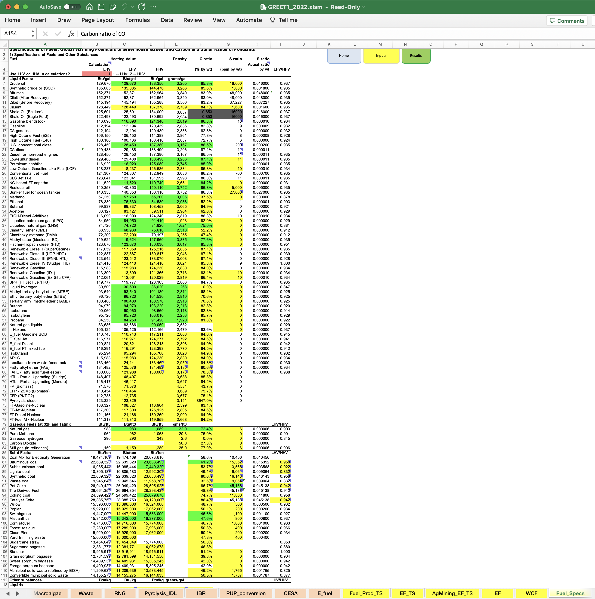

# HyARC Energy Constants and Assumptions

## Hydrogen Analysis Resource Center: Lower and Higher Heating Values of Hydrogen and Fuels

This H2A data is from the spreadsheet hosted at HyARC: https://h2tools.org/hyarc/hydrogen-data/lower-and-higher-heating-values-hydrogen-and-other-fuels

Data contains lower and higher heating values for hydrogen and various solid, liquid, and gaseous fuels.

### Original H2A Notes

EIA used the higher (gross) heating values (HHV) from the Annual Energy Report, 2002 (AER) in calculating feedstock prices as reported in the Annual Energy Outlook (AEO). In hydrogen analysis, most calculations are completed using the lower (net) heating value (LHV). Below, we've listed the HH's the EIA uses, as well as HH's and LHV's used in Argonne National Laboratory's GREET model.
The costs from the AEO are converted to an LHV basis for use in this model. The calculations for these conversions are shown below.

The price data is updated to the H2A reference year by multiplying by:

- (deflator price index from Table B for the H2A reference year from Table A/deflator price index for AEO data year)

- The price data is converted from HHV to LHV by multiplying by the ratio of the HHV to the LHV from Table A (e.g. 1.055 for natural gas, 0.0036 for electricity)

- Finally, the price is converted from an mmBTU basis to J basis by dividing by the conversion factor

### Column and Row Footnotes

Below are some of the cell values from the original table, for use in reading their footnotes:

- Lower Heating Value (LHV) [1]
- Higher Heating Value (HHV) [1]
- Btu/ft3 [2]
- Btu/lb [3]
- MJ/kg [4]
- Btu/lb [5]
- Coal (wet basis) [6]
- Bituminous coal (wet basis) [7]

### Footnotes

[1] The lower heating value (also known as net calorific value) of a fuel is defined as the amount of heat released by combusting a specified quantity (initially at 25°C) and returning the temperature of the combustion products to 150°C, which assumes the latent heat of vaporization of water in the reaction products is not recovered.								
The higher heating value (also known as gross calorific value or gross energy) of a fuel is defined as the amount of heat released by a specified quantity (initially at 25°C) once it is combusted and the products have returned to a temperature of 25°C, which takes into account the latent heat of vaporization of water in the combustion products.

[2] Btu =  British thermal unit.

[3] The heating values for gaseous fuels in units of Btu/lb are calculated based on the heating values in units of Btu/ft3 and the corresponding fuel density values. The heating values for liquid fuels in units of Btu/lb are calculated based on heating values in units of Btu/gal and the corresponding fuel density values.

[4] The heating values in units of MJ/kg, are converted from the heating values in units of Btu/lb.

[5] For solid fuels, the heating values in units of Btu/lb are converted from the heating values in units of Btu/ton.

[6] Coal characteristics assumed by GREET for electric power production.

[7] Coal characteristics assumed by GREET for hydrogen and Fischer-Tropsch diesel production.

### Original H2A Citation

GREET Transportation Fuel Cycle Analysis Model, GREET 1.8b, developed by Argonne National Laboratory, Argonne, IL, released May 8, 2008. http://www.transportation.anl.gov/software/GREET/index.html

### Updated Citation

A working link as of March 25, 2023 is https://greet.es.anl.gov/greet_1_series for the page "GREET 1 Series (Fuel-Cycle Model)". The website requires filling out a brief form for access.

The latest version for download, GREET_2022.zip, contains GREET1 and GREET2. Version 2 imports the Fuel data from Version 1. `GREET1_2022.xlsm` contains the fuel data on the sheet `Fuel_Specs`. For reference, a screenshot in this directory shows the sheet.

